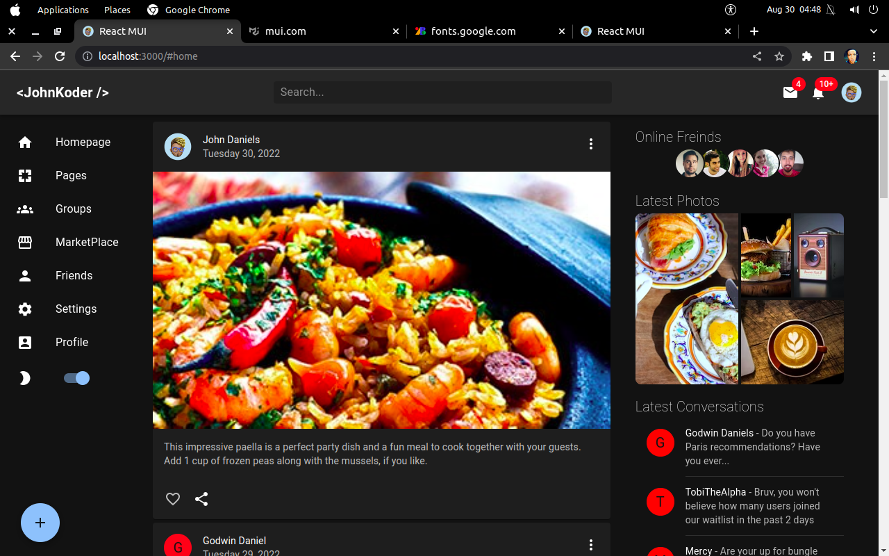
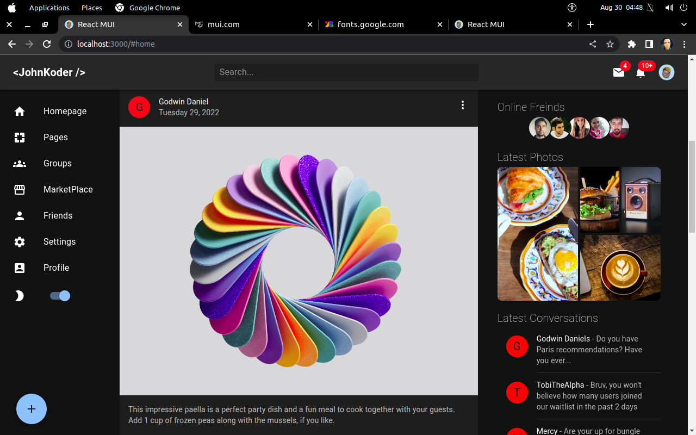
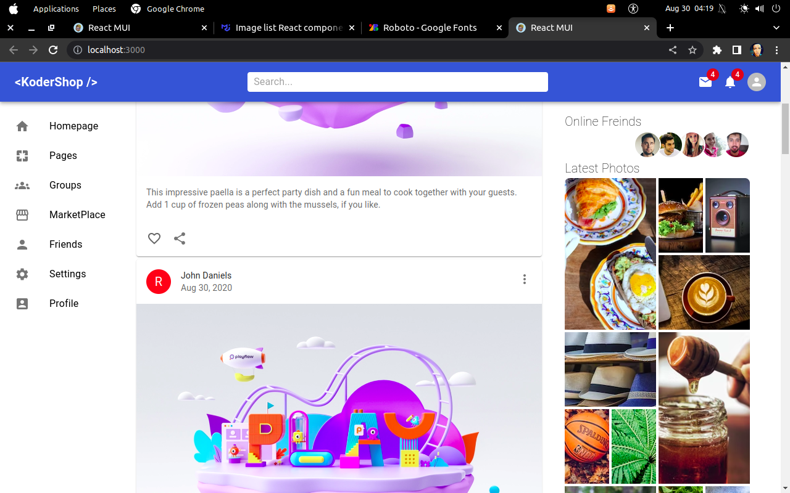

# React MUI

[](https://app.netlify.com/sites/react-mui-demo-johnkoder/deploys)

## showcasing material-ui's awesomeness

> Responsive Design
> Awesome user feedback
> Customizable Components
> Dark Mode

## Setup

#### Install

```bash
    npm install
```

#### Start

```bash
    npm start
```

## Some Shots







